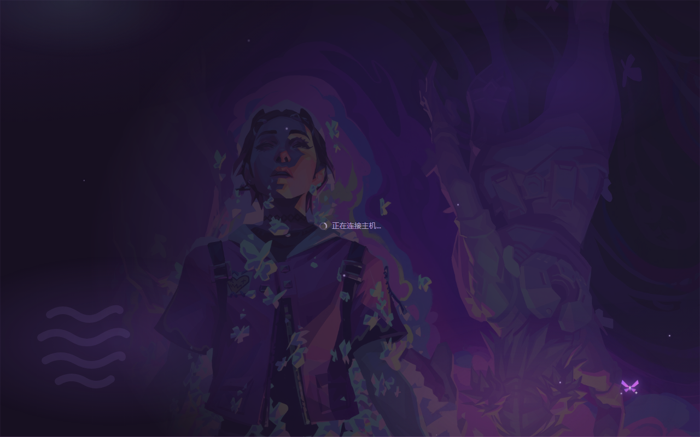

# Mirasim Skin Manager

Skin the [Mirasim](https://github.com/mirasim-ai/mirasim) desktop app, switch skins from
inside the app, and keep them across app updates. Ships with **Clove** — a smoke-and-butterflies
skin in the pastel-punk idiom of VALORANT's Clove.



- **F9** — skin picker (stock UI is always one click away)
- **F5** — reload the window (the app ships no native menu, so the loader restores this)
- Skins are plain folders outside the app, so editing one is just editing a file + F5
- An app update drops the loader; the optional scheduled task puts it back on its own

## How it works

Mirasim's window loads `dist/renderer/index.html` straight out of the packaged `app.asar`,
so `install.mjs` injects one small loader script there — that is the only change to the app.
Everything that matters lives **outside** the app, at `%USERPROFILE%\.mirasim\skins`: the skins
themselves, plus your pick in `localStorage`. Updates replace the asar (and the loader with it),
never your skins.

The loader mounts the active skin's `skin.css` / `skin.js` and owns the picker. The app's CSP
(`script-src 'self'`) allows this because a `file://` document treats other `file://` resources
as same-origin by scheme.

`install.mjs` also patches two colors in the main process that CSS cannot reach: the window
controls strip becomes fully transparent (so the page's gradient shows through behind the
caption buttons), and the pre-paint background color goes dark purple instead of near-black.
Both are optional — the installer warns and carries on if a new app build renames them.

## Install

Requires Windows, Node 18+, and Mirasim installed.

```sh
npm install
node install.mjs
```

Then **fully quit Mirasim and relaunch** (the asar is read at startup). Press **F9** to pick a
skin — Clove is the default on first run.

Non-standard install location? Set `MIRASIM_RESOURCES` to your Mirasim `resources` folder.
Want the skins somewhere else? Set `MIRASIM_SKINS_DIR`.

### Keep it through app updates

An app update replaces the files the loader lives in, so something has to put it back. Polling
cannot: the update lands seconds before the app relaunches, so a once-a-minute check always
arrives after the window has already read the unpatched files.

```
powershell -ExecutionPolicy Bypass -File register-autosync.ps1
```

That registers a task which keeps `watch-and-heal.mjs` alive — a small resident process watching
`resources/app.asar` and `~/.mirasim/app` with `fs.watch`. Any change hands off to `autosync.mjs`,
which owns the safety guards (size floor, parseable archive, settle recheck, payload-gap
detection). Measured end to end on a simulated update: **change to repaired in 9 seconds**, 2.5 of
them a deliberate debounce.

When a repair actually rewrites something, it raises a Windows notification telling you to
relaunch once. That part matters more than the speed — a silent repair is indistinguishable from a
broken skin to whoever is looking at the window, which is exactly how this kept coming back as a
bug report.

The task still fires every minute, but as a **watchdog** rather than a poller: the watcher takes a
single-instance lock and exits immediately when one is already alive, so a dead watcher is
resurrected within a minute and a live one costs nothing.

Expect **one relaunch** after a full-installer update no matter what. The asar is read at launch
and replaced seconds before it, so no amount of watching wins that race. In-app payload updates
are patched before the relaunch and come up already skinned.

Remove it all with:

```
Unregister-ScheduledTask -TaskName MirasimSkinAutoSync
```
### Uninstall

```sh
node install.mjs --restore
```

Restores the official asar from the backup `install.mjs` keeps beside it
(`app.asar.skinmgr.bak`). Your skins folder is left alone.

## Writing a skin

A skin is a folder in `%USERPROFILE%\.mirasim\skins`:

```
my-skin/
├── skin.json      name, author, description, accent color
├── skin.css       required
├── skin.js        optional — effects, pets, hotkeys
└── assets/        images, fonts, whatever
```

`skin.json`:

```json
{
  "label": "My Skin",
  "author": "you",
  "version": "1.0.0",
  "description": "one line, shown in the picker",
  "accent": "#b07dff"
}
```

Drop the folder in, double-click `sync-skins.cmd` (rebuilds the picker's manifest), press F5.

Two rules worth knowing:

- **CSS** can use relative paths — `url(./assets/foo.png)` resolves against the CSS file.
- **JS must use `window.__SKIN_ROOT`** for asset URLs. Relative paths in JS resolve against the
  app document inside the asar, not your skin folder. The loader sets `__SKIN_ROOT` before
  running `skin.js`.

Style the app by overriding its own theme tokens — `--surface-*`, `--th-*`, `--radius-*`,
`--font-sans`, `--font-mono` and friends. `skins/clove/skin.css` is a complete worked example.

## The Clove skin

Ink-purple surfaces, smoke-to-jacket gradients, and butterflies that behave like they live there.

- Shard-winged butterflies drawn in code, after Clove's own ability icons
- A butterfly pet that perches, relocates, startles at your cursor, and **bursts into particles
  and comes back** when clicked — drag it, right-click it for a menu
- Ambient drift: butterflies crossing the window, rising light dust, slow smoke plumes,
  breathing corner glows — all compositor animations, no idle rAF loop
- Click feedback: a double halo, petal dust, and sometimes a butterfly slipping out
- Usage popover: meters sweep from empty with a butterfly riding the tip, rows drift up out of
  the mist, a light sheen crosses the bar, the refresh control is a butterfly
- **NOT DEAD YET** — a banner and a resurrection when a session fails
- DIN-lineage type (Bahnschrift), condensed micro-labels, Cascadia Mono for code

Hotkeys: **Alt+Shift+B** butterfly swarm · **Alt+Shift+M** hide/show the pet ·
right-click the pet for quiet mode, reposition, or the skin picker.

Everything respects `prefers-reduced-motion`, and quiet mode stops the ambience entirely.

## Butterflies that are your agents

The pet is not only decoration. Mirasim already tracks what every one of your sessions is doing —
it just keeps that behind the task-monitor page. The skin subscribes to the same feed and gives it
a body: **one butterfly per live agent, orbiting the pet.**

- **Presence** — a butterfly means an agent is alive right now. Idle sessions are ignored; this
  shows what is *happening*, not what exists.
- **State, without clicking anything** — wings beat briskly while work lands, and a butterfly
  pulses each time a tool step completes. An agent that has gone quiet for 90 seconds dims and
  slows to a crawl (the app's own `stalled`). One that needs you turns amber, leaves the orbit and
  pulses above the pet — the only state allowed to interrupt.
- **Identity, on demand** — hover for the session title and the current step
  ("Read tsconfig.json"); click to jump straight into that session.
- **Endings** — a finished run drifts off and scatters into light. A failed one bursts, and
  **NOT DEAD YET** fires. Success pops no toast: every completed turn announcing itself becomes
  unbearable within the hour.
- Cap of five, with a `+N` badge for the rest. Drag the pet and the whole entourage follows.
  Quiet mode grounds them but keeps them — they are information, not ambience.

Whether an agent was already running when the page loaded matters: those butterflies appear with
no entrance, because they did not just start.

### For skin authors

The feed lives in `skins/_shared/agent-bridge.js` and knows nothing about butterflies, so any skin
can render it in its own vocabulary:

```js
var ag = window.__mirasimAgents;          // absent if the bridge never connected
ag.on('start',    function (e) { /* e.title, e.agent, e.workdir, e.activity */ });
ag.on('activity', function (e) { /* one tool step landed */ });
ag.on('beat',     function (e) { /* still alive, same step */ });
ag.on('waiting',  function (e) { /* e.waiting is the question */ });
ag.on('done',     function (e) { /* e.text is the verdict */ });
ag.on('failed',   function (e) {});
ag.on('gone',     function (e) {});
ag.focus(e);                              // jump the app to that session
```

Everything degrades to silence: with no feed there are no events, and your skin behaves exactly as
it does without one. Always guard on `window.__mirasimAgents` being there.

### Developing against a fake app

`fake-tasksense.mjs` serves the real renderer plus your skin over http and replays a scripted agent
feed, so every state is reproducible without starting real agents:

```
node fake-tasksense.mjs                    # one agent: start -> work -> stall -> ask -> fail
node fake-tasksense.mjs --scenario many    # seven at once (the cap and the +N badge)
node fake-tasksense.mjs --quiet            # quiet mode
node fake-tasksense.mjs --nobridge         # prove your skin survives without the feed
```

It prints the timeline with a page-time offset per frame, and the story advances on the page's own
clock, so `msedge --headless=new --virtual-time-budget=7600 --screenshot=x.png
http://127.0.0.1:8788/` lands a shot at a chosen moment. `node test-diff.mjs` asserts the
frame-diffing logic on its own in plain node. Run `node install.mjs` once first — the harness
serves the renderer out of the `build/` tree that extracts.

## Sending her on errands

Right-click the pet and the top of the menu is a list of errands. Pick one and she opens a **real
new session** and goes and does it — then flies back with the answer.

The list is data, not code: `skins/clove/errands.js`. Edit it freely.

```js
window.__cloveErrands = [
  { label: '仓库现在什么样',
    prompt: '汇报未提交的改动和最近三个提交，三句话说完。只读，不要修改任何文件。',
    safe: true },
  { label: 'Skin self-check',
    prompt: 'Is the loader in app.asar, which payload does state.json point at, …',
    workdir: 'C:\\path\\to\\repo',      // omitted = wherever you were last working
    safe: true },
];
```

`safe: true` skips the confirmation, and should only be set for an errand whose prompt is fixed
and read-only. Anything else — including **其他… (say it yourself)**, the free-text entry — shows
you the resolved working directory and the full prompt, and dispatches nothing until you click
派出去.

An errand's butterfly wears a **mint ring**, so work you ordered never gets confused with work you
started. It is also the one completion allowed to speak up: a normal run finishes quietly, but an
errand flies back to the pet and pops its verdict in a bubble, because you asked for it.

Three gates, deliberately:

- **Three at a time.** In-flight dispatches count, so a fast double-click cannot slip a fourth
  past the check.
- **Free text always confirms.** The destination directory is on screen before anything runs.
- **She never answers a permission prompt for you.** The protocol offers it; this does not use it.
  An errand that needs approval turns amber and comes to you, like any other agent.

Sent her somewhere she shouldn't be? Right-click → **叫她回来 (call her back)** stops every errand
in flight.

### How it works

`{type:'prompt', clientRef, prompt, workdir, agent}` over the app's own socket, with `sessionKey`
omitted so it opens a new session. The server answers `{type:'accepted', clientRef, sessionKey}`,
which is how the errand's session is claimed exactly rather than guessed at, or
`{type:'error', clientRef, message}` — whose reason is shown to you verbatim rather than swallowed.
`stop` ends one. Model and effort are deliberately not sent, so an errand inherits your own
defaults.

Develop against it without spending tokens:

```
node fake-tasksense.mjs --errand 2200                  # menu -> dispatch -> ringed butterfly -> report
node fake-tasksense.mjs --free 1400 --confirm-only     # hold on the confirmation, dispatch nothing
node fake-tasksense.mjs --errand 2200 --refuse         # the server says no
node fake-tasksense.mjs --errand 2200 --errand-times 5 # prove the gate holds at three
node fake-tasksense.mjs --errand 1500 --callback 3400  # call her back
```

## Credits & disclaimer

Clove is a character from **VALORANT**, © Riot Games. This is an unofficial, non-commercial fan
project made under [Riot's Legal Jibber Jabber](https://www.riotgames.com/en/legal) fan-content
policy; it is not endorsed by or affiliated with Riot Games. The wallpaper in
`skins/clove/assets/` is Riot's key art, included for that non-commercial fan use — swap in your
own image if you would rather not ship it. All other artwork in the skin (butterflies, smoke,
sparkles, HUD marks) is original geometry drawn in code.

The code is MIT-licensed (see `LICENSE`); the license covers the code, not the game artwork.

## 中文说明

给 Mirasim 桌面端换肤，**F9** 呼出皮肤面板，**F5** 重载界面。皮肤是 `%USERPROFILE%\.mirasim\skins`
下的普通文件夹，app 更新不会丢；asar 里只注入一个几 KB 的加载器。

安装：`npm install` → `node install.mjs` → **完全退出并重开 Mirasim**。
更新后自动恢复：`powershell -ExecutionPolicy Bypass -File register-autosync.ps1`（每 3 分钟静默检查，
发现加载器被更新覆盖就自动重装，之后重开一次 app 即可）。还原官方界面：`node install.mjs --restore`。

自制皮肤：建个文件夹放 `skin.json` + `skin.css`（可选 `skin.js`、`assets/`），双击 `sync-skins.cmd`，按 F5。
注意 JS 里取资源必须用 `window.__SKIN_ROOT`，CSS 用相对路径即可。

内置 Clove 皮肤：紫粉烟雾配色、代码绘制的碎片刃翼蝴蝶、会重生的蝴蝶桌宠、氛围蝶群与光尘、
点击光圈、用量面板动画、会话失败时的 NOT DEAD YET。快捷键 Alt+Shift+B 放蝶群、Alt+Shift+M 收桌宠。
本项目为非商业同人作品，Clove 与 VALORANT 版权归 Riot Games 所有，与 Riot 无关联。

### 蝴蝶就是你的 agent

桌宠不只是装饰。Mirasim 本来就在跟踪每个会话在干什么，只是把它锁在「任务指挥室」那一页里。
皮肤订阅了同一条流，给它一个身体：**每个正在跑的 agent，在桌宠身边有一只蝴蝶。**

- **在不在**：有蝴蝶就有 agent 活着。空闲会话不算——它表达的是"正在发生什么"，不是"有哪些会话"。
- **什么状态，不用点**：干活时翅膀密，每完成一步工具调用抖一下；超过 90 秒没动静就变暗、慢摆
  （对应 app 自己的 `stalled`）；需要你回答时转成琥珀色、脱离轨道、在桌宠上方搏动——这是唯一
  允许打扰你的状态。
- **是谁，要问才说**：悬停显示会话标题和当前那一步（"Read tsconfig.json"），点一下直接跳进去。
- **收场**：跑完的飘走散成光点；失败的炸开，NOT DEAD YET 弹出。成功**不弹提示**——每个回合都
  弹一次，两小时后你就想卸载了。
- 上限 5 只，多的挂 `+N` 徽标。拖桌宠，整群跟着走。安静模式让它们停飞但**不让它们消失**——
  它们是信息，不是氛围。

页面加载时就已经在跑的 agent，蝴蝶**不放入场特效**——因为它不是刚刚才开始的。

写皮肤的人可以直接订阅 `skins/_shared/agent-bridge.js` 抛出的事件（`start` / `activity` /
`beat` / `waiting` / `done` / `failed` / `gone`），用自己的视觉语汇渲染；拿不到 feed 时全部静默
降级，皮肤退回没有这功能时的样子。开发时用 `node fake-tasksense.mjs` 起一个假 app，六种状态都
能复现，不用起真 agent。

### 派她去办事

右键桌宠，菜单顶部就是差事清单。点一条，她**开一个真的新会话**去办，办完飞回来把结论告诉你。

清单是数据不是代码，在 `skins/clove/errands.js`，随你改。`safe: true` 免确认，**只有内容写死
且只读的差事才该标 safe**；其余的（包括「其他…（自己说）」那条自由输入）都会先把**最终工作
目录**和 prompt 全文摆给你看，不点「派出去」就什么都不会发生。

差事的蝴蝶带一道**薄荷色细环**，所以你点的活和你自己开的活永远分得清。它也是唯一被允许开口的
「完成」——普通会话跑完是安静散掉，差事跑完会飞回她身边弹气泡，因为那是你要的答案。

三道闸门是故意的：

- **同时最多三件。**在途的也算，所以手快双击也塞不进第四件。
- **自由输入必须确认。**目标目录在动手之前就在屏幕上。
- **她绝不替你点权限确认。**协议里有这个能力，这里不用。差事要授权就自己变琥珀色飞到你眼前，
  跟别的 agent 一样等你按。

派错地方了？右键 →「叫她回来」，在途的差事全部停掉。

底层是 `{type:'prompt', clientRef, prompt, workdir, agent}`，省略 sessionKey 所以开新会话；
服务端回 `{type:'accepted', clientRef, sessionKey}`，据此**精确认领**那个会话，而不是猜；被拒时
回 `{type:'error', clientRef, message}`，原因原样显示给你，不吞。model / effort 故意不发，让差事
继承你自己的默认设置。

开发时不用花 token：`node fake-tasksense.mjs --errand 2200`（整条回路）、`--free 1400
--confirm-only`（停在确认框，什么都不派）、`--refuse`（服务端拒绝）、`--errand-times 5`（验闸门）、
`--callback 3400`（叫她回来）。
